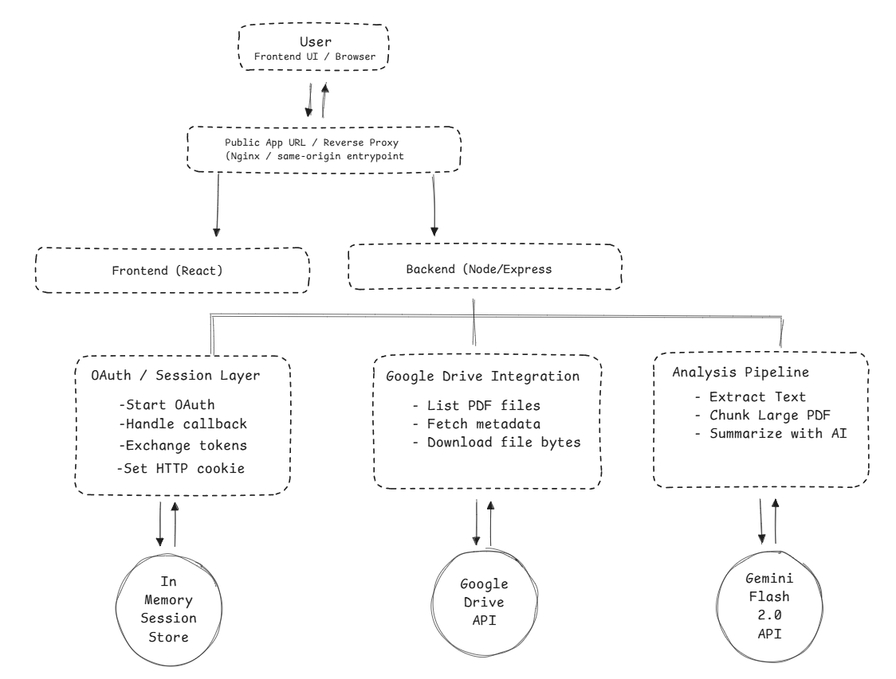


# AI-Powered Document Analyzer

A full-stack application that connects to Google Drive via OAuth2, retrieves user documents, and generates AI-powered summaries using LLM processing pipeline.

---

## 🚀 Live

[https://YOUR_DEPLOYED_URL](https://martin-mastless-superserviceably.ngrok-free.dev/)

---

## 🧱 Stack

**Frontend**
- React + TypeScript (Vite)

**Backend**
- Node.js + Express (TypeScript)

**AI / NLP**
- Google Gemini API
- LangChain (text splitting + model integration)
- Zod (structured outputs)

**Infra**
- GCP Compute Engine
- Nginx (same-origin routing)
- ngrok (for OAuth development)

---



## 🔐 Authentication

- Google OAuth2
- Session-based authentication via HTTP-only cookies

> Sessions are stored in-memory for this implementation. In production, this would be replaced with a shared store (e.g., Redis).

---

## 📂 Data Integration

- Fetches 10 recent PDF files from Google Drive
- Displays metadata (name, modified date)
- Allows per-file analysis on demand

---

## 🧠 AI Processing

### Strategy

A staged summarization pipeline is used to handle documents of varying size:

- **Small documents** → single-pass analysis  
- **Large documents** → chunked processing

```
Document → Chunking → Per-chunk analysis → Aggregation
```
* However, since we are using the free tier of Gemini which enforces strict rate limits, the threshold for classifying a PDF as “small” has been set to 120,000 characters, which is relatively high.
### LangChain Usage

- `RecursiveCharacterTextSplitter` for controlled chunking with overlap  
- `ChatGoogleGenerativeAI` for structured LLM interaction  

LangChain is used as a **low-level primitive**, while orchestration is implemented explicitly to maintain control over performance, cost, and output structure.


## 🖥️ Architecture and Key Decisions

- **On-demand analysis**
  - Documents are analyzed only when the user explicitly requests it.
  - This minimizes unnecessary backend and AI model calls, reducing latency and cost.

- **Rate limiting**
  - A rate limiter is applied to protect the system and stay within free-tier AI API limits.
  - Ensures predictable behavior under constrained quotas.

- **Result caching**
  - Previously analyzed documents are cached in memory.
  - Improves response time for repeat requests and avoids redundant AI invocations.

- **Chunked processing for large documents**
  - Large inputs are split into smaller chunks to stay within LLM context limits.
  - Each chunk is processed independently and results are aggregated.
  - Enables reliable processing of arbitrarily large documents.

---

## ⚠️ Limitations

- **In-memory cache and sessions**
  - Data is not persistent and is lost on server restart.
  - Not suitable for multi-instance or distributed environments.

- **Single service integration**
  - Currently supports only Google Drive.

- **Limited file support**
  - Only text-based PDFs are supported (no OCR for scanned documents).

- **Per-instance caching**
  - Cache is not shared across instances.


## 🖥️ More reliable and production architecture

For a production-grade system serving many users, I would move from a synchronous request/response design to an **event-driven architecture** with asynchronous document processing.

### Core principles

- **Decouple ingestion from analysis**
  - The user-facing API should accept a document, persist metadata, and enqueue a processing job.
  - Heavy work such as OCR, text extraction, chunking, embedding generation, and summarization should happen asynchronously.

- **Use specialized services**
  - Split responsibilities into independent services, for example:
    - **API Gateway / Web App** — authentication, session handling, dashboard APIs
    - **Document Ingestion Service** — file registration, metadata persistence, job creation
    - **OCR / Extraction Service** — text extraction from PDFs and scanned documents
    - **LLM Processing Service** — summarization, keyword extraction, enrichment
    - **Embedding Service** — chunk embedding generation for semantic retrieval
    - **Search / Retrieval Service** — semantic search and question answering over processed documents

- **Queue-based processing**
  - Document analysis should be backed by a queue or pub/sub system.
  - This allows the platform to:
    - absorb spikes in traffic
    - retry failed jobs safely
    - scale workers independently from the web tier
    - avoid blocking user-facing requests on long-running analysis

> ⚠️ Note  
> The architecture outlined above is intentionally high-level and not exhaustive.  
> A production system requires deeper consideration across multiple dimensions, including:
> 
> - **Cost vs. benefit tradeoffs** (e.g., LLM usage, storage, and compute scaling)
> - **User experience design** (what the core workflows are and what latency is acceptable)
> - **Feature scope** (e.g., summarization vs. search vs. conversational Q&A)
> - **Data lifecycle and retention policies**
> - **Security, privacy, and access control**
> - **Operational concerns** (monitoring, alerting, failure handling)
> 
> The final architecture should be driven by the **specific product requirements and user flows**, rather than a one-size-fits-all design.

### Suggested production flow


### Backend

```bash
cd backend
npm install
npm run dev
```

### Frontend

```bash
cd frontend
npm install
npm run dev
```

### Environment

Create `.env` (backend):

```
PORT=8080
SESSION_SECRET=...
GOOGLE_CLIENT_ID=...
GOOGLE_CLIENT_SECRET=...
GOOGLE_REDIRECT_URI=...
GOOGLE_API_KEY=...
```


## 🚀 Roadmap & Iteration Plan

### +1 Day

Focus: **broader document support and better usability**

- **Pagination / progressive loading**
  - Add pagination or incremental loading for document lists so the dashboard remains fast and usable as the number of files grows

- **Basic UX hardening**
  - Clearer empty states and error messages
  - Better feedback during analysis

---

### +5 Days

Focus: **expand integrations and improve product usefulness**
- **Support more PDF types**
  - Improve handling across a wider range of PDFs, especially multi-page and more complex layouts
  - Strengthen extraction reliability for real-world documents rather than only simpler text PDFs
- **Support additional document sources**
  - Add integrations such as Dropbox and OneDrive
  - Generalize the ingestion layer so the dashboard is not tightly coupled to Google Drive only

- **More consistent file metadata model**
  - Normalize file metadata across providers so the frontend can handle multiple sources cleanly
---

### +20 Days

Focus: **production readiness and long-running workflow support**


- **Richer filtering and organization**
  - Filter by provider, file type, or date
  - Improve navigation once multiple storage providers are connected
  
- **Persistent caching**
  - Move analysis cache from in-memory storage to a durable shared store
  - Preserve results across restarts and make reuse possible beyond a single running instance

- **OCR support**
  - Add OCR for scanned PDFs and image-based documents
  - Expand support beyond text-extractable PDFs

- **Better error handling**
  - Improve error classification and user-facing recovery paths
  - Distinguish between auth failures, provider API issues, extraction failures, OCR failures, and model failures

- **Background processing status**
  - Move long-running document analysis into asynchronous/background jobs
  - Expose progress states such as:
    - queued
    - extracting text
    - running OCR
    - generating summary
    - completed / failed

- **Progress indicators in UI**
  - Add progress bars or status badges so users understand what is happening during large or slow analyses

---
